# Part 1. Инструмент ipcalc
## 1.1. Сети и маски

- Определи и запиши в отчёт(!ПРИМЕЧАНИЕ!
ipcalc не может работать с бинарным представление маски подсети. Чтобы использовать такую маску в ipcalc придется перевести ее в префиксный вид или стандартный.):
    - 1. Адрес сети 192.167.38.54/13 (Address: 192.167.38.52........)
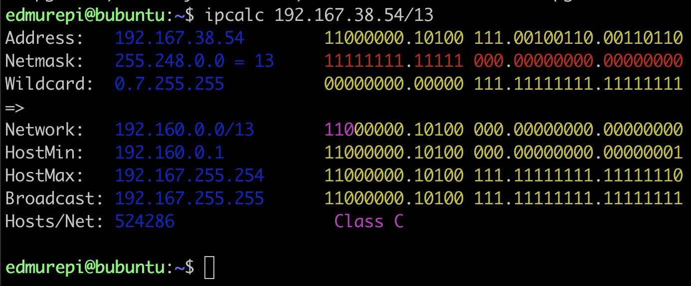

    - 2. Перевод маски 255.255.255.0 в префиксную и двоичную запись, /15 в обычную и двоичную, 11111111.11111111.11111111.11110000 в обычную и префиксную (префиксная форма записи /24, двоичная форма записи 11111111.11111111.11111111.00000000)
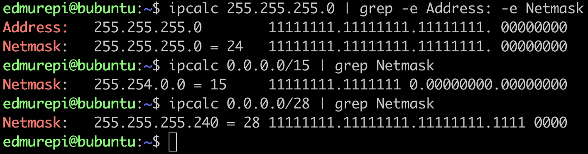

    - 3. Минимальный и максимальный хост в сети 12.167.38.4 при масках: /8, 11111111.11111111.00000000.00000000, 255.255.254.0 и /4
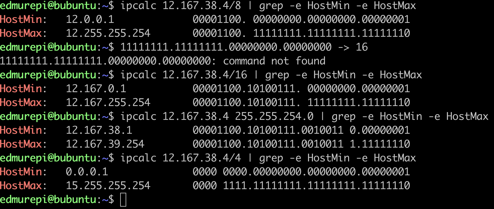

## 1.2. localhost

 - Определи и запиши в отчёт, можно ли обратиться к приложению, работающему на localhost, со следующими IP: 194.34.23.100, 127.0.0.2, 127.1.0.1, 128.0.0.1(!ПРИМЕЧАНИЕ! если IP подмечается как loopback значит мы можем к нему обращаться)
 .png)

## 1.3. Диапазоны и сегменты сетей

 - Определи и запиши в отчёт(!ПРИМЕЧАНИЕ!Чтобы определить, является ли IP-адрес публичным или частным, необходимо проверить, попадает ли он в один из следующих диапазонов частных IP-адресов, определенных в RFC 1918.
***10.0.0.0/8 (10.0.0.0 - 10.255.255.255)
172.16.0.0/12 (172.16.0.0 - 172.31.255.255)
192.168.0.0/16 (192.168.0.0 - 192.168.255.255)
Если IP-адрес попадает в один из этих диапазонов, то он является частным. Если он не попадает в эти диапазоны, то он является публичным.
Например, чтобы определить тип IP-адреса 192.168.4.2, мы проверяем, попадает ли он в диапазон 192.168.0.0/16. Поскольку он попадает в этот диапазон, то он является частным IP-адресом.
!ПРИМЕЧАНИЕ!Чтобы определить, какие из перечисленных IP-адресов могут быть шлюзом для сети 10.10.0.0/18, необходимо проверить, попадают ли они в диапазон этой сети.
Сеть 10.10.0.0/18 имеет маску 255.255.192.0, что означает, что первые 18 бит (или 2 октета и 6 бит третьего октета) должны быть фиксированными.
Диапазон сети 10.10.0.0/18 составляет от 10.10.0.0 до 10.10.63.255.):***
    - 1. Какие из перечисленных IP можно использовать в качестве публичного, а какие только в качестве частных: 10.0.0.45, 134.43.0.2, 192.168.4.2, 172.20.250.4, 172.0.2.1, 192.172.0.1, 172.68.0.2, 172.16.255.255, 10.10.10.10, 192.169.168.1  
        - 10.0.0.45 - частный
        - 192.168.4.2 - частный
        - 10.10.10.10 - частный
        - 172.20.250.4 - частный
        - 172.16.255.255 - частный
        - 172.0.2.1 - публичный
        - 192.172.0.1 - публичный
        - 172.68.0.2 - публичный
        - 134.43.0.2 - публичный
        - 192.169.168.1 - публичный
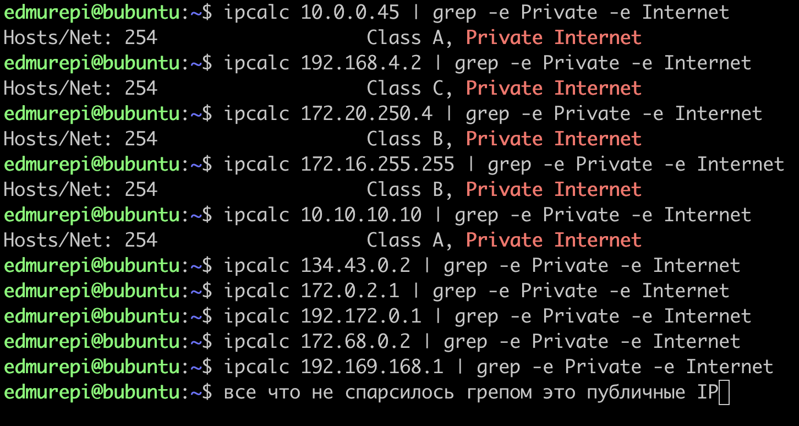
    - 2. Какие из перечисленных IP адресов шлюза возможны у сети 10.10.0.0/18: 10.0.0.1, 10.10.0.2, 10.10.10.10, 10.10.100.1, 10.10.1.255  
        - 10.10.0.2 - возможен
        - 10.10.10.10 - возможен
        - 10.10.1.255 - возможен
        - 10.0.0.1
        - 10.10.100.1
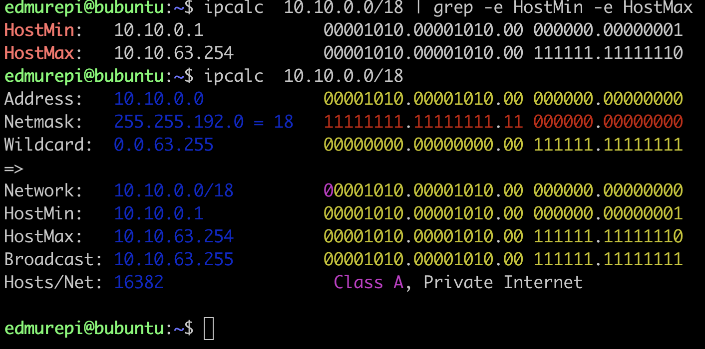

# Part 2. Статическая маршрутизация между двумя машинами

 - С помощью команды ip a посмотри существующие сетевые интерфейсы.
    - В отчёт помести скрин с вызовом и выводом использованной команды.
    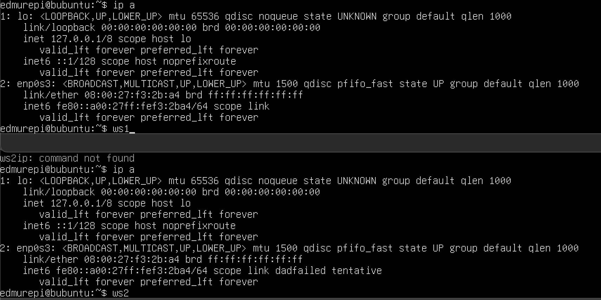

 - Опиши сетевой интерфейс, соответствующий внутренней сети, на обеих машинах и задать следующие адреса и маски: ws1 - 192.168.100.10, маска /16, ws2 - 172.24.116.8, маска /12.
    - В отчёт помести скрины с содержанием изменённого файла etc/netplan/00-installer-config.yaml для каждой машины.
    
    Необходимо прописать обоим конфигам yaml после применить netplan apply и перезагрузить системы:
    

 - Выполни команду netplan apply для перезапуска сервиса сети.
    - В отчёт помести скрин с вызовом и выводом использованной команды.
    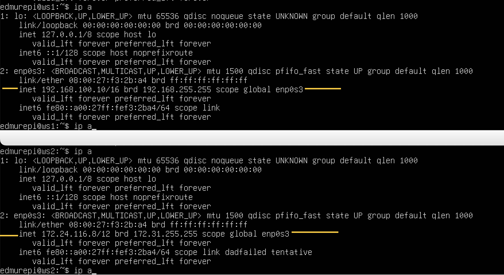

## 2.1. Добавление статического маршрута вручную

 - Добавь статический маршрут от одной машины до другой и обратно при помощи команды вида ip r add.
 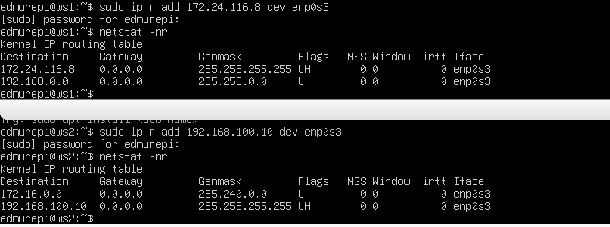

 - Пропингуй соединение между машинами.
    - В отчёт помести скрин с вызовом и выводом использованных команд.
    

## 2.2. Добавление статического маршрута с сохранением

 - Перезапусти машины.

 - Добавь статический маршрут от одной машины до другой с помощью файла /etc/netplan/00-installer-config.yaml.
    - В отчёт помести скрин с содержанием изменённого файла /etc/netplan/00-installer-config.yaml.
    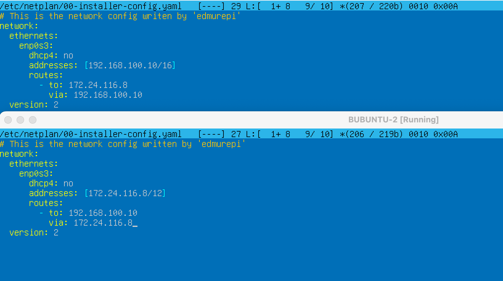

 - Пропингуй соединение между машинами.
    - В отчёт помести скрин с вызовом и выводом использованной команды.
    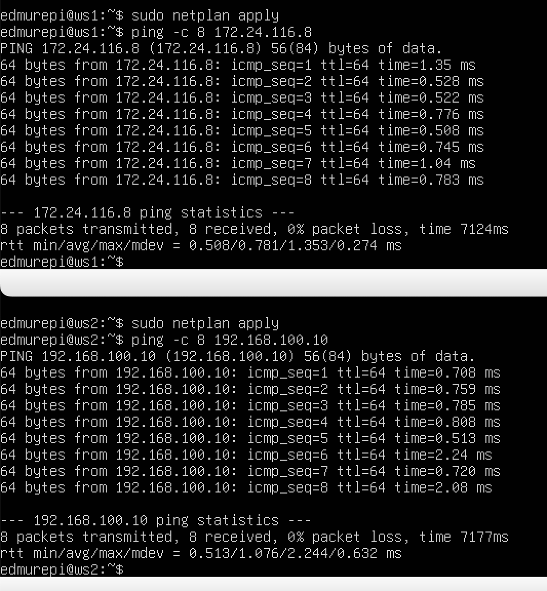

# Part 3. Утилита iperf3
## 3.1. Скорость соединения

 - Переведи и запиши в отчёт: 8 Mbps в MB/s, 100 MB/s в Kbps, 1 Gbps в Mbps.  
    - 8 Mbps = 1 MB/s  
    - 100 MB/s = 819200 Kbps  
    - 1 Gbps = 1024 Mbps  

# 3.2. Утилита iperf3

 - Измерь скорость соединения между ws1 и ws2.
    - В отчёт помести скрины с вызовом и выводом использованных команд.
     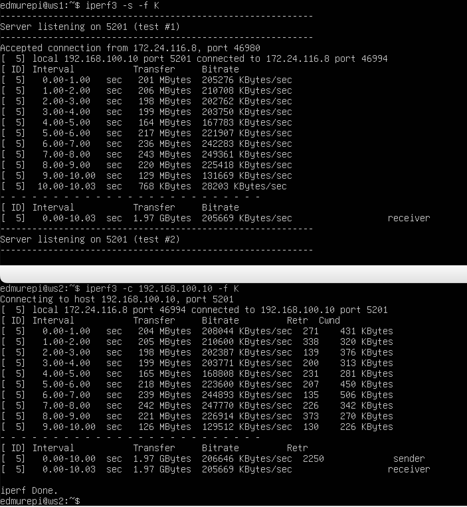    

# Part 4. Сетевой экран
## 4.1. Утилита iptables

 - Создай файл /etc/firewall.sh, имитирующий фаерволл, на ws1 и ws2:

 - Нужно добавить в файл подряд следующие правила:
    1. На ws1 примени стратегию, когда в начале пишется запрещающее правило, а в конце пишется разрешающее правило (это касается пунктов 4 и 5).

    2. На ws2 примени стратегию, когда в начале пишется разрешающее правило, а в конце пишется запрещающее правило (это касается пунктов 4 и 5).

    3. Открой на машинах доступ для порта 22 (ssh) и порта 80 (http).

    4. Запрети echo reply (машина не должна «пинговаться», т.е. должна быть блокировка на OUTPUT).

    5. Разреши echo reply (машина должна «пинговаться»).      
        - В отчёт помести скрины с содержанием файла /etc/firewall для каждой машины.          
        
        ***Если сначала стоит запрещающее правило, то оно имеет приоритет перед последующим разрешающим.***  
        
     
## 4.2. Утилита nmap

 - Командой ping найди машину, которая не «пингуется», после чего утилитой nmap покажи, что хост машины запущен.  
 - Проверка: в выводе nmap должно быть сказано: Host is up.  
     - В отчёт помести скрины с вызовом и выводом использованных команд ping и nmap.  
        
     
     
# Part 5. Статическая маршрутизация сети
## Подними пять виртуальных машин (3 рабочие станции (ws11, ws21, ws22) и 2 роутера (r1, r2)).
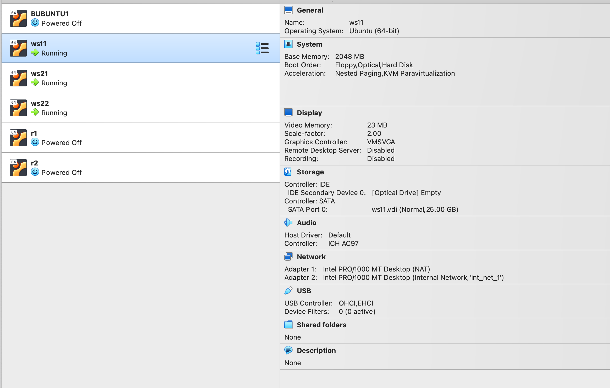

## 5.1. Настройка адресов машин
## Настрой конфигурации машин в *etc/netplan/00-installer-config.yaml* согласно сети на рисунке.
- В отчёт помести скрины с содержанием файла *etc/netplan/00-installer-config.yaml* для каждой машины.  

### Перезапусти сервис сети. Если ошибок нет, то командой `ip -4 a` проверь, что адрес машины задан верно. Также пропингуй ws22 с ws21. Аналогично пропингуй r1 с ws11.
- В отчёт помести скрины с вызовом и выводом использованных команд.

***ping***  

## 5.2. Включение переадресации IP-адресов
### Для включения переадресации IP, выполни команду на роутерах:
`sysctl -w net.ipv4.ip_forward=1`

*При таком подходе переадресация не будет работать после перезагрузки системы.*
- В отчёт помести скрин с вызовом и выводом использованной команды.  
### Открой файл */etc/sysctl.conf* и добавь в него следующую строку:
`net.ipv4.ip_forward = 1`
*При использовании этого подхода, IP-переадресация включена на постоянной основе.* 
- В отчёт помести скрин с содержанием изменённого файла */etc/sysctl.conf*.

## 5.3. Установка маршрута по-умолчанию
### Настрой маршрут по-умолчанию (шлюз) для рабочих станций. Для этого добавь `default` перед IP роутера в файле конфигураций.
- В отчёт помести скрин с содержанием файла *etc/netplan/00-installer-config.yaml*;

### Вызови `ip r` и покажи, что добавился маршрут в таблицу маршрутизации.
- В отчёт помести скрин с вызовом и выводом использованной команды.

### Пропингуй с ws11 роутер r2 и покажи на r2, что пинг доходит. Для этого используй команду:
`tcpdump -tn -i eth0`
- В отчёт помести скрин с вызовом и выводом использованных команд.

Пинг не проходит на ws11, т.к. роутер "не знает" куда вернуть ответ, при этом передача пакетов с машины осуществляется.Запускаем на r2 утилиту tcpdump, она позволяет прослушать порты и вывести на экран информацию с каких IP адресов приходят пакеты. В данном случае слушаем интерфейс enp0s8 и отправлено 4 пакета, также на роутере видим что 4 пакета дошли.

## 5.4. Добавление статических маршрутов
### Добавь в роутеры r1 и r2 статические маршруты в файле конфигураций. Пример для r1 маршрута в сетку 10.20.0.0/26:
- В отчёт помести скрины с содержанием изменённого файла *etc/netplan/00-installer-config.yaml* для каждого роутера.

### Вызови `ip r` и покажи таблицы с маршрутами на обоих роутерах. Пример таблицы на r1:
- В отчёт помести скрин с вызовом и выводом использованной команды.

### Запусти команды на ws11:
`ip r list 10.10.0.0/[маска сети]` и `ip r list 0.0.0.0/0`
- В отчёт помести скрин с вызовом и выводом использованных команд;
- В отчёте объясни, почему для адреса 10.10.0.0/\[маска сети\] был выбран маршрут, отличный от 0.0.0.0/0, хотя он попадает под маршрут по-умолчанию.

!!!ПРИМЕЧАНИЕ!!!Для адреса 10.10.0.0/18 был выбран не 0.0.0.0/0, т.к. машина ws11 соединена с сетью 10.10.0.0/18 по своему IP-адресу 10.10.0.2, для других маршрут по умолчанию, который указан в файле 10.10.0.1.

## 5.5. Построение списка маршрутизаторов
### Запусти на r1 команду дампа:
`tcpdump -tnv -i eth0`
### При помощи утилиты **traceroute** построй список маршрутизаторов на пути от ws11 до ws21.
- В отчёт помести скрины с вызовом и выводом использованных команд (tcpdump и traceroute);

Команда traceroute работает на основе отправки ICMP-эхо-запросов (ICMP echo requests) с возрастающим TTL (Time To Live) от 1 до 30. Каждый маршрутизатор на пути уменьшает TTL на 1 и отправляет ICMP-эхо-ответ (ICMP echo reply) назад, если TTL достигает 0.В нашем примере:  
 - ws11 отправляет ICMP-эхо-запрос с TTL=1 к ws21.
 - Маршрутизатор 10.10.0.1 получает пакет и уменьшает TTL до 0, отправляя ICMP-эхо-ответ назад к ws11.
 - ws11 отправляет новый ICMP-эхо-запрос с TTL=2 к ws21.
 - Маршрутизатор 10.10.0.1 получает пакет и отправляет его к следующему маршрутизатору 10.100.0.12.
 - Маршрутизатор 10.100.0.12 получает пакет и уменьшает TTL до 1, отправляя ICMP-эхо-ответ назад к ws11.
 - ws11 отправляет новый ICMP-эхо-запрос с TTL=3 к ws21.
 - Маршрутизатор 10.100.0.12 получает пакет и отправляет его к следующему маршрутизатору 10.20.0.10.
 - Маршрутизатор 10.20.0.10 получает пакет и уменьшает TTL до 0, отправляя ICMP-эхо-ответ назад к ws11.  

Таким образом, traceroute строит список маршрутизаторов на пути от ws11 до ws21, основываясь на полученных ICMP-эхо-ответах.

## 5.6. Использование протокола **ICMP** при маршрутизации
### Запусти на r1 перехват сетевого трафика, проходящего через eth0 с помощью команды:
`tcpdump -n -i eth0 icmp`
### Пропингуй с ws11 несуществующий IP (например, *10.30.0.111*) с помощью команды:
`ping -c 1 10.30.0.111`
- В отчёт помести скрин с вызовом и выводом использованных команд.

### Сохрани дампы образов виртуальных машин.
# Part 6. Динамическая настройка IP с помощью DHCP

*В данном задании используются виртуальные машины из Части 5.*

### Для r2 настрой в файле */etc/dhcp/dhcpd.conf* конфигурацию службы **DHCP**:  
sudo apt-get install isc-dhcp-server

### 1) Укажи адрес маршрутизатора по-умолчанию, DNS-сервер и адрес внутренней сети. Пример файла для r2:

subnet 10.100.0.0 netmask 255.255.0.0 {}  

subnet 10.20.0.0 netmask 255.255.255.192  
{  
    range 10.20.0.2 10.20.0.50;  
    option routers 10.20.0.1;  
    option domain-name-servers 10.20.0.1;  
}  

### 2) В файле *resolv.conf* пропиши `nameserver 8.8.8.8`.
- В отчёт помести скрины с содержанием изменённых файлов.  

### Перезагрузи службу **DHCP** командой `systemctl restart isc-dhcp-server`. Машину ws21 перезагрузи при помощи `reboot` и через `ip a` покажи, что она получила адрес. Также пропингуй ws22 с ws21.
- В отчёт помести скрины с вызовом и выводом использованных команд.  

### Укажи MAC адрес у ws11, для этого в *etc/netplan/00-installer-config.yaml* надо добавить строки: `macaddress: 10:10:10:10:10:BA`, `dhcp4: true`.
- В отчёт помести скрин с содержанием изменённого файла *etc/netplan/00-installer-config.yaml*.

### Для r1 настрой аналогично r2, но сделай выдачу адресов с жесткой привязкой к MAC-адресу (ws11). Проведи аналогичные тесты.
- В отчёте этот пункт опиши аналогично настройке для r2.  

### Запроси с ws21 обновление ip адреса.
- В отчёте помести скрины ip до и после обновления.
- В отчёте опиши, какими опциями **DHCP** сервера пользовался в данном пункте.

- В этом задании мы использовали следующие опции DHCP-сервера:
    - range - указывает диапазон адресов, которые могут быть выданы клиентам
    - option routers - указывает адрес маршрутизатора по-умолчанию
    - option domain-name-servers - указывает адрес DNS-сервера
    - host - указывает жесткую привязку к MAC-адресу клиента
    - hardware ethernet - указывает MAC-адрес клиента
    - fixed-address - указывает фиксированный IP-адрес, который будет выдан клиенту

# Part 7. NAT
*В данном задании используются виртуальные машины из Части 5.*
### В файле */etc/apache2/ports.conf* на ws22 и r1 измени строку `Listen 80` на `Listen 0.0.0.0:80`, то есть сделай сервер Apache2 общедоступным.
- В отчёт помести скрин с содержанием изменённого файла.  
  
### Запусти веб-сервер Apache командой `service apache2 start` на ws22 и r1. 
- В отчёт помести скрины с вызовом и выводом использованной команды.  
  
### Добавь в фаервол, созданный по аналогии с фаерволом из Части 4, на r2 следующие правила:
### 1) Удаление правил в таблице filter - `iptables -F`;
### 2) Удаление правил в таблице "NAT" - `iptables -F -t nat`;
### 3) Отбрасывать все маршрутизируемые пакеты - `iptables --policy FORWARD DROP`.
### Запусти файл также, как в Части 4.
### Проверь соединение между ws22 и r1 командой `ping`.
*При запуске файла с этими правилами, ws22 не должна «пинговаться» с r1.*
- В отчёт помести скрины с вызовом и выводом использованной команды.

### Добавь в файл ещё одно правило:
### 4) Разрешить маршрутизацию всех пакетов протокола **ICMP**.
### Запусти файл также, как в Части 4.
### Проверь соединение между ws22 и r1 командой `ping`.
*При запуске файла с этими правилами, ws22 должна «пинговаться» с r1.*
- В отчёт помести скрины с вызовом и выводом использованной команды.  
  
  
### Добавь в файл ещё два правила:
### 5) Включи **SNAT**, а именно маскирование всех локальных ip из локальной сети, находящейся за r2 (по обозначениям из Части 5 - сеть 10.20.0.0).
*Совет: стоит подумать о маршрутизации внутренних пакетов, а также внешних пакетов с установленным соединением.*
### 6) Включи **DNAT** на 8080 порт машины r2 и добавить к веб-серверу Apache, запущенному на ws22, доступ извне сети.
*Совет: стоит учесть, что при попытке подключения возникнет новое tcp-соединение, предназначенное ws22 и 80 порту.*
- В отчёт помести скрин с содержанием изменённого файла.  
  
### Запусти файл также, как в Части 4.
*Перед тестированием рекомендуется отключить сетевой интерфейс **NAT** (его наличие можно проверить командой `ip a`) в VirtualBox, если он включен.*
### Проверь соединение по TCP для **SNAT**: для этого с ws22 подключиться к серверу Apache на r1 командой:
`telnet [адрес] [порт]`  
  
### Проверь соединение по TCP для **DNAT**: для этого с r1 подключиться к серверу Apache на ws22 командой `telnet` (обращаться по адресу r2 и порту 8080).
- В отчёт помести скрины с вызовом и выводом использованных команд.  
  
### Сохрани дампы образов виртуальных машин.
**P.S. Ни в коем случае не сохраняй дампы в гит!**

# Part 8. Дополнительно. Знакомство с SSH Tunnels

*В данном задании используются виртуальные машины из Части 5.*

### Запусти на r2 фаервол с правилами из Части 7.
### Запусти веб-сервер **Apache** на ws22 только на localhost (то есть в файле */etc/apache2/ports.conf* измени строку `Listen 80` на `Listen localhost:80`).
### Воспользуйся *Local TCP forwarding* с ws21 до ws22, чтобы получить доступ к веб-серверу на ws22 с ws21.

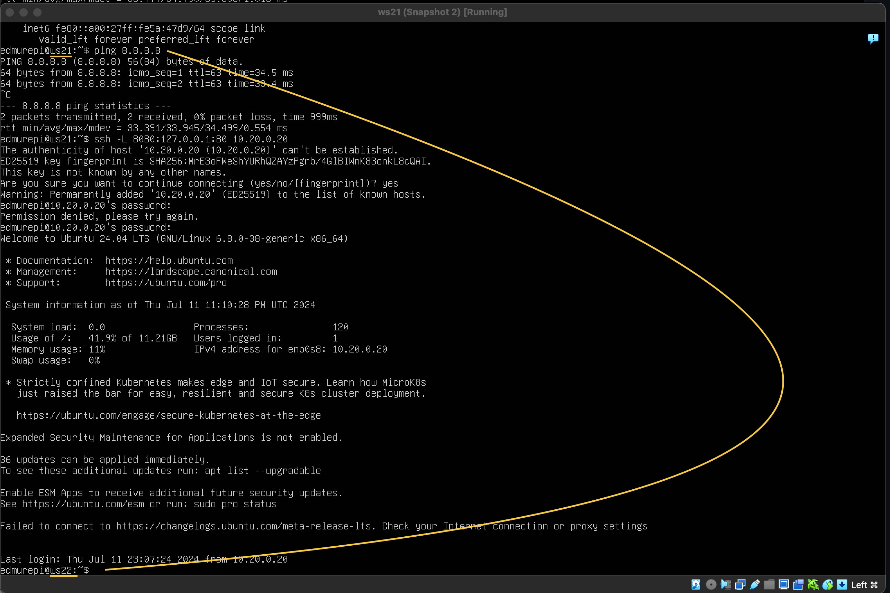

  
 - На машине ws22: создадим соединение с машины ws22, на которой установлен сервер ssh, с машиной ws 21
 - На машине ws22: с помощью команды ssh -L прокинем "прямое" соединение с машины ws21 на машину ws22.
 - На машине ws21 прослушаем процесс и убьем процесс отвечающий за соединение после чего убеждаемся в ws22 что соединение прервано  
### Воспользуйся *Remote TCP forwarding* c ws11 до ws22, чтобы получить доступ к веб-серверу на ws22 с ws11.

  
- Пробрасываем тонель чтобы обойти файрвол

### Для проверки, сработало ли подключение в обоих предыдущих пунктах, перейди во второй терминал (например, клавишами Alt + F2) и выполни команду:
`telnet 127.0.0.1 [локальный порт]`
- В отчёте опиши команды, необходимые для выполнения этих четырёх пунктов, а также приложи скриншоты с их вызовом и выводом.
  
 - Чтобы проверить, установлено ли соединение, перейдите во второй терминал (нажмите Option + Fn + F2 находясь в терминале машины ws11) и выполните команду: telnet 127.0.0.1 [локальный порт]. Во время выполнения этой команды нажмите любую клавишу.
### Сохрани дампы образов виртуальных машин.
**P.S. Ни в коем случае не сохраняй дампы в гит!**
